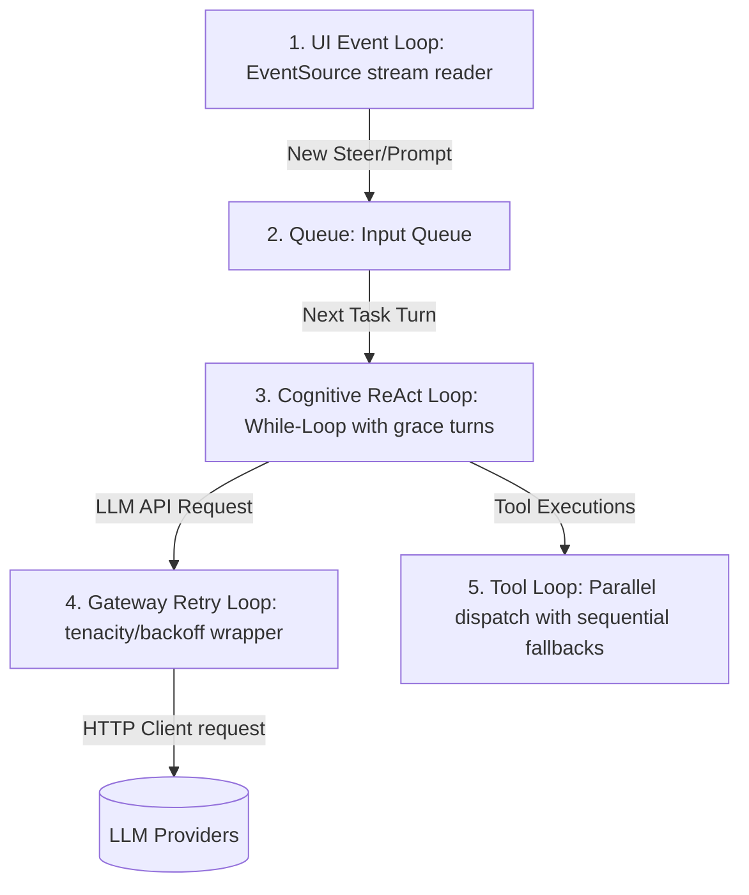

# Agent Execution and System Loops: Analysis, Comparisons, and Recommendations

This document provides a comprehensive, source-grounded research analysis of the loop patterns, designs, and trade-offs used across the 10 reference codebases in the workspace. These codebases span different layers of the agent stack: from core cognitive runtimes to networking gateways, transport stream consumers, and infrastructure orchestrators.

---

## 1. Taxonomy of Loops in Agent Systems

In a production-grade agent system (June 2026), loops are not restricted to the core LLM execution loop. Rather, they are structured in a four-tier stack, with each tier addressing a specific layer of concern:

```
┌─────────────────────────────────────────────────────────────────────────┐
│  Tier 1: Client/UI Streaming Loop (e.g. assistant-ui)                   │
│  └─ Consumes token streams in real-time, manages UI render cycles       │
└────────────────────────────────────┬────────────────────────────────────┘
                                     ▼
┌─────────────────────────────────────────────────────────────────────────┐
│  Tier 2: Agent Reasoning-Action (ReAct) Loop (e.g. Hermes, LangGraph)   │
│  └─ Core cognitive loop: thought -> tool call -> observation            │
└────────────────────────────────────┬────────────────────────────────────┘
                                     ▼
┌─────────────────────────────────────────────────────────────────────────┐
│  Tier 3: Endpoint Gateway Resilience Loop (e.g. LiteLLM, OpenRouter)    │
│  └─ Wraps LLM/tool HTTP requests in retry/backoff wrappers              │
└────────────────────────────────────┬────────────────────────────────────┘
                                     ▼
┌─────────────────────────────────────────────────────────────────────────┐
│  Tier 4: Infrastructure Orchestration Loop (e.g. Open Responses)        │
│  └─ Manages docker compose states, health monitoring, subprocesses     │
└─────────────────────────────────────────────────────────────────────────┘
```

### Tier 1: Agent Reasoning-Action (ReAct) Loops
These loops drive the cognitive cycles of the agent. They handle LLM prompting, tool result collection, and state updating.
*   **Examples**: [conversation_loop.py](https://github.com/NousResearch/hermes-agent/agent/conversation_loop.py) (Hermes), [agent-loop.ts](https://github.com/badlogic/pi-mono/packages/agent/src/agent-loop.ts) (Pi), [turn.rs](https://github.com/openai/codex/codex-rs/core/src/session/turn.rs) (Codex), [_loop.py](https://github.com/langchain-ai/langgraph/libs/langgraph/langgraph/pregel/_loop.py) (LangGraph), [agent.py](https://github.com/langchain-ai/langchain/libs/langchain/langchain_classic/agents/agent.py) (LangChain).

### Tier 2: Endpoint Gateway Resilience & Retry Loops
These loops wrap LLM API completions and external tool HTTP calls. They intercept rate limits, connection drops, and API crashes, using backoff and fallback providers to ensure the agent loop does not terminate prematurely.
*   **Examples**: [main.py](https://github.com/BerriAI/litellm/litellm/main.py) (LiteLLM), [retries.ts](https://github.com/OpenRouterTeam/typescript-sdk/src/lib/retries.ts) (OpenRouter SDK).

### Tier 3: Real-Time Event-Stream Consumption Loops
These loops run on the client or UI side, continuously fetching chunked Server-Sent Events (SSE) data, rebuilding complete lines from fragmented TCP packets, and updating the UI state machine.
*   **Examples**: [eventSource.ts](https://github.com/assistant-ui/assistant-ui/packages/react-pi/src/client/eventSource.ts) (assistant-ui).

### Tier 4: Infrastructure CLI & Service Loops
These loops manage local development processes, such as tailing Docker container logs, checking service health states, and running setup configuration surveys.
*   **Examples**: [main.go](https://github.com/open-responses/open-responses/main.go) (Open Responses).

---

## 2. Codebase Deep Dives

### A. Nous Hermes Agent (Python) — Sequential ReAct Loop
Hermes runs a synchronous while-loop inside `run_conversation` in [conversation_loop.py](https://github.com/NousResearch/hermes-agent/agent/conversation_loop.py#L589-L614).

*   **When Used**: Driven during any active session run to process user input and execute tasks.
*   **Why Used**: Guarantees step-by-step progress tracking, cost management, and model output repairs.
*   **Mechanics**:
    1.  **Dual Budget Gating**: Gated by hard limits (`max_iterations`, default 90) and `IterationBudget` tokens.
    2.  **Grace Turns**: If the budget hits zero, the harness grants one last `_budget_grace_call` turn to let the model write a final response instead of crashing.
    3.  **Real-Time Steer Draining**: Intercepts steering inputs (`_drain_pending_steer`) before the LLM call, wrapping them in a tool message to preserve strict role alternation.
    4.  **Failover Provider Cascades**: Catch API client exceptions, swap active models to fallback providers, rebuild prompt contexts, and execute retries with jittered exponential backoffs up to 120s.

### B. Pi Agent & OpenClaw (TypeScript) — Nested Dual Loops
Both Pi in [agent-loop.ts](https://github.com/badlogic/pi-mono/packages/agent/src/agent-loop.ts#L170-L266) and OpenClaw in [agent-loop.ts](https://github.com/openclaw/openclaw/packages/agent-core/src/agent-loop.ts#L297-L429) run nested `while` loops.

*   **When Used**: Drives interactive coding sessions (Pi CLI) and multi-modal assistants (OpenClaw Canvas/Voice).
*   **Why Used**: Isolates the main thread from follow-up events, manages parallel tool execution, and integrates lifecycle hooks.
*   **Mechanics**:
    -   **Outer Loop**: Listens for follow-up/queued commands after the main turn is completed.
    -   **Inner Loop**: Handles tool call processing and steering.
    -   **Sequential/Parallel Dispatch**: Inspects tool modes; if *any* tool requests sequential execution, all are run sequentially. Otherwise, they run concurrently using `Promise.all`.
    -   **Hooks**: Invokes `beforeToolCall` and `afterToolCall` hooks to allow system overrides or sanitization.

### C. OpenAI Codex (Rust) — Stateful Sampling Turn Loop
Codex runs a state-sampling loop inside `run_turn` in [turn.rs](https://github.com/openai/codex/codex-rs/core/src/session/turn.rs#L215-L223).

*   **When Used**: Driven during command execution turns in the Rust-based Codex coding CLI.
*   **Why Used**: Leverages Rust's speed, manages a local multi-environment instruction context, and handles context auto-compaction.
*   **Mechanics**:
    -   **Input Queue Draining**: Iterates by pulling inputs from a thread-safe `InputQueue` (`sess.input_queue.get_pending_input`).
    -   **Dynamic Compaction**: Evaluates token limits on every iteration (`run_pre_sampling_compact` and `run_auto_compact`). If exceeded, it triggers context summarization/pruning before the next LLM call.

### D. LangGraph (Python) — Pregel Actor Graph Loop
LangGraph represents logic as a directed cyclic graph executed by `PregelLoop` in [_loop.py](https://github.com/langchain-ai/langgraph/libs/langgraph/langgraph/pregel/_loop.py#L592-L674).

*   **When Used**: Used for complex multi-agent workflows, branching state machines, and human-in-the-loop steps.
*   **Why Used**: Enforces state channel integrity, handles concurrent actor node executions, and supports time-travel replays.
*   **Mechanics**:
    -   **Pregel Supersteps**: Nodes execute concurrently during a graph "tick". 
    -   **Checkpointing**: Saves state channel values (`apply_writes`) to a persistence store at the end of each tick, enabling durable resume/replay.
    -   **Interrupts**: Evaluates matching `interrupt_before` or `interrupt_after` criteria, raising `GraphInterrupt` exceptions to yield control back to the orchestrator.

### E. LangChain Classic (Python) — Bounded ReAct Loop
LangChain's classic `AgentExecutor` runs a `while` loop inside `_call` in [agent.py](https://github.com/langchain-ai/langchain/libs/langchain/langchain_classic/agents/agent.py#L1585-L1600).

*   **When Used**: Drives classic single-agent ReAct cycles.
*   **Why Used**: Simplicity, wall-clock timing constraints, and parser error recovery.
*   **Mechanics**:
    -   **Limits**: Bounded by iteration caps (`max_iterations`, default 15) and execution duration.
    -   **Parser Correction**: If parsing fails, it intercepts the error and routes it back to the LLM via a virtual `_Exception` tool, allowing the model to correct its formatting.
    -   **Early Stopping**: Stoppage yields final answers using either `"force"` (static error response) or `"generate"` (a final turn instructing the model to synthesize an answer from the collected observations).

### F. LiteLLM (Python) — Declarative Endpoint Retry Loop
LiteLLM leverages `tenacity` retry wrappers inside `completion_with_retries` and `acompletion_with_retries` in [main.py](https://github.com/BerriAI/litellm/litellm/main.py#L5840-L5899).

*   **When Used**: Invoked during any outgoing LLM chat completion request.
*   **Why Used**: Abstracting HTTP transport errors (rate limits, timeouts) away from the cognitive agent loop.
*   **Mechanics**:
    -   **Declarative Retry Decorators**: Wraps execution in `tenacity.Retrying` or `tenacity.AsyncRetrying`.
    -   **Jittered Backoff**: Employs exponential backoff (`tenacity.wait_exponential(multiplier=1, max=10)`) and attempts caps (default 3) to retry calls on transient errors.

### G. OpenRouter SDK (TypeScript) — Asynchronous Connection Backoff Loop
The SDK drives an asynchronous `while(true)` loop inside `retryBackoff` in [retries.ts](https://github.com/OpenRouterTeam/typescript-sdk/src/lib/retries.ts#L153-L195).

*   **When Used**: Wrapped around all HTTP client network operations.
*   **Why Used**: Protects against client-side request failures and respects server-side rate-limiting headers.
*   **Mechanics**:
    -   **Error Classification**: Splits errors into `PermanentError` (aborts loop immediately) and `TemporaryError` (retryable 5XX or timeout).
    -   **Retry-After Parsing**: Reads HTTP `Retry-After` headers. If present, it waits for the specified duration before retrying; otherwise, it defaults to exponential backoff with random jitter.

### H. assistant-ui (TypeScript/React) — Reconnecting SSE Stream Loop
`assistant-ui` manages event stream decoding inside `openPiEventStream` in [eventSource.ts](https://github.com/assistant-ui/assistant-ui/packages/react-pi/src/client/eventSource.ts#L144-L192).

*   **When Used**: Runs in the client web browser when a user has a streaming conversation open.
*   **Why Used**: Real-time rendering of tokens, handling client network disconnects, and parsing fragmented network frames.
*   **Mechanics**:
    -   **Outer Reconnection Loop (`while (!closed)`)**: Periodically re-fetches the SSE endpoint after connection dropouts, using a snapshot-first strategy (replaces state instead of replaying).
    -   **Inner Reader Loop (`while (!closed)`)**: Iteratively reads chunks from the HTTP response body stream reader (`reader.read()`).
    -   **SSE Parser Loop**: Breaks text buffers into SSE frames (`data:`, `event:`, `id:`) using newline boundaries, filtering out heartbeat keep-alive events.

### I. Open Responses (Go) — CLI & Subprocess Orchestration Loops
Open Responses implements loops within its Go Cobra command handlers in [main.go](https://github.com/open-responses/open-responses/main.go#L1805-L1851).

*   **When Used**: Driven during service startup, stopping, configuration setup, and resource status checks.
*   **Why Used**: Tailing container logs, checking Docker Compose container health, and validating developer configuration settings.
*   **Mechanics**:
    -   **CLI Surveys**: Loops through environment variables prompting the developer for configuration settings.
    -   **Docker Polling**: Tail-loops Docker logs and polls container stats to ensure Postgres, Redis, and API containers are healthy.

---

## 3. Comparative Loop Matrix

| Feature / Metric | Nous Hermes | Pi / OpenClaw | OpenAI Codex | LangGraph | LangChain | LiteLLM | OpenRouter SDK | assistant-ui | Open Responses |
| :--- | :--- | :--- | :--- | :--- | :--- | :--- | :--- | :--- | :--- |
| **Language** | Python | TypeScript | Rust | Python | Python | Python | TypeScript | TypeScript | Go |
| **Loop Layer** | Cognitive ReAct | Cognitive ReAct | Cognitive ReAct | Cognitive Graph | Cognitive ReAct | Gateway Retry | Gateway Retry | Client UI SSE | Infrastructure CLI |
| **Primary File** | [conversation_loop.py](https://github.com/NousResearch/hermes-agent/agent/conversation_loop.py) | [agent-loop.ts](https://github.com/badlogic/pi-mono/packages/agent/src/agent-loop.ts) | [turn.rs](https://github.com/openai/codex/codex-rs/core/src/session/turn.rs) | [_loop.py](https://github.com/langchain-ai/langgraph/libs/langgraph/langgraph/pregel/_loop.py) | [agent.py](https://github.com/langchain-ai/langchain/libs/langchain/langchain_classic/agents/agent.py) | [main.py](https://github.com/BerriAI/litellm/litellm/main.py) | [retries.ts](https://github.com/OpenRouterTeam/typescript-sdk/src/lib/retries.ts) | [eventSource.ts](https://github.com/assistant-ui/assistant-ui/packages/react-pi/src/client/eventSource.ts) | [main.go](https://github.com/open-responses/open-responses/main.go) |
| **Iteration Gating** | Hard limit (90) + Token Budget | Queue size / User Stop | Queue draining | Superstep limit | Hard limit (15) + duration | Attempt limit (default 3) | Elapsed time max (1 hr) | Client closed flag | CLI args / Service status |
| **Resilience / Fallback** | Fallback cascades + Grace turn | Hook overrides | Compact-on-fail | Graph Node retry | `_Exception` tool parsing | Tenacity Retry / Backoff | Connection retry + backoff | Reconnection + delay backoff | Exit 1 / docker restart |
| **Interrupt Hooks** | Yes (`_interrupt_requested`) | Yes (`AbortSignal`) | Yes (`InputQueue`) | Yes (`GraphInterrupt`) | Yes (Generator yield) | No | No | Yes (`AbortController`) | Yes (`Ctrl+C`) |
| **Concurrency** | Sequential | Sequential & Parallel | Parallel | Node Concurrent execution | Async Concurrent (optional) | Multi-threading | Asynchronous | Asynchronous | Goroutines |
| **State Persistence** | SQLite Turn snapshots | Event log append | SQLite Rollout items | State channel checkpoints | In-Memory list | Redis / Postgres | No | Browser state store | docker volumes |

---

## 4. Architectural Recommendations for the Agent Harness

When building a modern, model-agnostic agent harness (June 2026), these loop patterns should be organized into a multi-layered design. This prevents overloading the core cognitive loop with networking resilience details, while keeping the client UI responsive:



### Recommendation 1: Layered Loop Separation (Gateway vs. Cognitive)
*   **Why**: Do not pollute the cognitive reasoning engine with connection retries or endpoint fallback delays.
*   **How**: Implement a gateway retry loop (using Tenacity or similar TS backoff models) at the HTTP client boundary. Let it absorb 429s, transient network dropouts, and rate limits. The cognitive ReAct loop should only deal with *logical* issues (e.g., tool failures, incorrect outputs, token budgeting).

### Recommendation 2: Bounded ReAct Loops with Grace Transitions
*   **Why**: Unbounded loops lead to cost explosions and API timeouts.
*   **How**: Combine an iteration cap (e.g., 30 turns) with a remaining token budget. When limits are exceeded, grant a single **Grace Turn** that injects a system warning instructing the model to synthesize a final answer from the collected observations instead of calling new tools.

### Recommendation 3: Event-Driven Steer Injection
*   **Why**: Allows the developer to redirect an agent mid-turn without breaking message role sequences.
*   **How**: Use Codex's input queue pattern. Before starting a turn iteration, pull any pending steering messages, format them as tool results or system reminders, and append them to the conversation context.

### Recommendation 4: Reconnecting Client Stream Consumer
*   **Why**: SSE connections are brittle and drop frequently in web and mobile environments.
*   **How**: Employ assistant-ui's outer reconnection loop. Design a **Snapshot-First** recovery model where the client does not need to store and replay missed events. Upon reconnecting, the server simply sends the current snapshot of the conversation state, allowing the client to rebuild its UI state cleanly.

---

## 5. Gotchas & Error Handling in Loops: Parsing Failures & Recovery

Production loops frequently encounter malformed or partial LLM outputs when parsing tool calls or structured arguments. The following sections outline critical failure modes, mitigations, and recovery strategies.

### A. The "Brittle Regex Parser" Gotcha
*   **Gotcha**: Developers often write regular expressions to extract JSON payloads from LLM outputs (e.g., matching text between the first `{` and last `}`). This approach is fragile; it fails when the model outputs multiple JSON blocks, nested objects containing curly braces, escaped quotes, or conversational prefix/suffix text.
*   **Mitigation**: Minimize or avoid regular expressions for parsing logic. Instead, prioritize:
    1.  **Programmatic Parser Libraries**: Use standard JSON, JSON5, or robust stream-parsing tokenizers (e.g., partial JSON parsers) that build an Abstract Syntax Tree (AST) to extract structural components programmatically.
    2.  **LLM-First Semantic/Structured Parsing**: When syntactic complexity is high or schemas vary, delegate parsing to a lightweight, dedicated parser LLM call using native JSON schemas (structured outputs).
    3.  **Deterministic Fallbacks**: If deterministic code is used, keep it simple, non-regex, and isolated only to high-confidence syntax validation (e.g., checking block boundaries) rather than complete semantic extraction.

### B. LangChain's Virtual `_Exception` Tool Recovery Loop
*   **Gotcha**: When an LLM produces a tool call containing schema violations or malformed formats, throwing an exception terminates the execution loop, stalling the agent.
*   **Mitigation (Self-Healing Loop)**: Implement a virtual tool pattern similar to LangChain's `_Exception` tool:
    1.  **Intercept the Parser Exception**: Catch the JSON or validation exception in the tool execution gateway.
    2.  **Re-Route as Tool Observation**: Format the error details (e.g., `"Error: The tool 'calculate_metrics' requires 'start_date' as an ISO-8601 string, but 'June 10th' was provided."`) into a system message disguised as a tool result from a virtual `_Exception` tool (or standard tool error output).
    3.  **Self-Correction Turn**: Append this observation to the message history and let the outer cognitive loop continue. The LLM will see its previous invalid argument, read the exception output, and attempt to output a corrected tool payload in the next turn.

### C. The Infinite Repair Loop
*   **Gotcha**: If the LLM repeatedly generates invalid tool formats, a self-healing loop can run infinitely, racking up substantial API costs and token usage.
*   **Mitigation**: Bounded recovery. Limit the number of sequential parser recovery attempts (`max_parse_failures`, typically set to `1` or `2`). If the threshold is exceeded, bypass the self-healing step and raise a hard exception, routing it to the outer gateway retry layer or terminating the execution loop with a graceful fallback answer.

