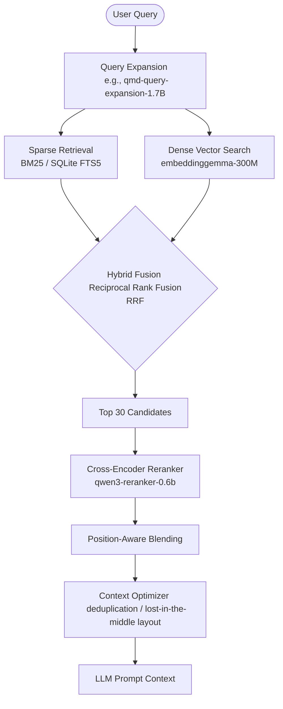

# Embeddings, Rerankers, and Semantic Retrieval Pipelines

A modern AI agent harness must retrieve highly relevant context from large document databases or conversation logs to pack into the prompt. To do this efficiently, agents utilize a multi-stage retrieval pipeline combining **Bi-encoders (Embeddings)** and **Cross-encoders (Rerankers)**.



---

## 1. Embeddings (Bi-encoders)

Embeddings represent text chunks as dense, continuous vectors in a high-dimensional vector space. They operate on a **Bi-encoder** architecture.

### 1.1 Architecture & Similarity Metrics
*   **Bi-encoder Design**: The query and the documents are encoded independently into vectors by the embedding model. Because the document embeddings can be pre-computed and stored, similarity search reduces to simple vector math at query time.
*   **Similarity Metrics**:
    *   *Cosine Similarity*: Measures the cosine of the angle between two vectors ($\cos(\theta) = \frac{A \cdot B}{\|A\| \|B\|}$). Best for normalized vectors where magnitude is irrelevant.
    *   *Dot Product*: Simple scalar product ($A \cdot B$). Extremely fast to compute, especially on hardware accelerators, but requires vectors of uniform length.
    *   *L2 (Euclidean) Distance*: Measures physical distance between endpoints ($\|A - B\|_2$).

```
[Query] -----> [Embedding Model] -----> [Query Vector] ──┐
                                                         ├──> [Cosine Similarity]
[Document] --> [Embedding Model] -----> [Doc Vector] ────┘
```

### 1.2 Scaling & Vector Indexes
To search millions of vectors in sub-millisecond times, databases construct index graphs instead of running exhaustive scans ($O(N)$):
*   **HNSW (Hierarchical Navigable Small World)**: A multi-layer graph index. Top layers have long-range links for fast routing, while bottom layers contain dense, short-range clusters. Highly accurate, but requires holding the graph in RAM.
*   **IVF (Inverted File Index)**: Clusters vectors into voronoi cells. Queries only search vectors inside the nearest cell clusters. Minimizes memory footprints but can lower recall.

### 1.3 Embedding Model Selection
*   **API-based**: OpenAI `text-embedding-3` or Voyage-3 (which offers domain-specific models like `voyage-code-3`).
*   **Local Open-Source**: Local Gemma or Qwen embeddings. For instance, the `qmd` search engine in [SKILL.md](https://github.com/NousResearch/hermes-agent/optional-skills/research/qmd/SKILL.md#L70) auto-downloads `embeddinggemma-300M-Q8_0` (~300MB) for on-device vector generation.

> [!TIP]
> **Pros**: Highly scalable. Can search millions of documents in milliseconds using Approximate Nearest Neighbors (ANN). Good at capturing semantic relationships.
> **Cons**: Poor at matching exact keywords, phone numbers, alphanumeric IDs, or rare spelling variations.

---

## 2. Rerankers (Cross-encoders)

Rerankers evaluate the relevance of document chunks against a query using a **Cross-encoder** architecture.

### 2.1 Architecture & Computational Complexity
*   **Cross-encoder Design**: The query and a candidate document are fed *together* into the transformer model. Self-attention runs across both the query tokens and document tokens simultaneously.
*   **Relevance Scoring**: Because the model performs joint attention, it captures high-granularity semantic alignments, syntax matches, and vocabulary overlaps that independent embeddings miss.
*   **Complexity**: Evaluating a single pair requires a full transformer inference pass. For $N$ documents, running a cross-encoder requires $O(N)$ inference steps. Because of this high cost, rerankers **cannot scale to search millions of documents** directly.

```
[Query] + [Document] -----> [Reranker Model (Joint Attention)] -----> [Relevance Score (0.0 - 1.0)]
```

### 2.2 Reranker Model Selection
*   **API-based**: Cohere `Rerank 4 Pro` (high quality), `Rerank 4 Fast` (latency optimized), or Voyage `rerank-2.5`.
*   **Local Open-Source**: local GGUF models. For example, `qmd` indexes notes locally and uses `qwen3-reranker-0.6b-q8_0` (~640MB) to perform local cross-attention.

---

## 3. The Multi-Stage Semantic Retrieval Pipeline

To balance speed and quality, production agent systems implement a multi-stage pipeline that uses embeddings for high-throughput filtering, and rerankers for high-precision ordering.

### Phase 1: Retrieval (Candidate Generation)
*   **Dual retrieval**: Runs two parallel queries:
    1.  *Sparse Retrieval*: BM25 keyword matching (e.g., using SQLite FTS5). Excellent for exact matches, code identifiers, and specific names.
    2.  *Dense Retrieval*: Vector database search using embeddings. Excellent for natural language concepts.

### Phase 2: Hybrid Fusion
The sparse and dense result lists are merged.
*   **Reciprocal Rank Fusion (RRF)**: Evaluates the rank of document $d$ in the sparse ($R_{sparse}$) and dense ($R_{dense}$) lists to generate a unified score:
    $$RRF(d) = \frac{1}{k + R_{sparse}(d)} + \frac{1}{k + R_{dense}(d)}$$
    Where $k$ is a constant (commonly $60$).
*   *qmd Optimization*: The local engine `qmd` implements RRF ($k=60$) and applies a top-rank weight boost: rank #1 gets $+0.05$, and ranks #2-3 get $+0.02$.

### Phase 3: Reranking
*   The top-k (e.g. top 30) fused candidates are submitted to the Cross-encoder Reranker.
*   The reranker computes a precise score between $0.0$ and $1.0$ for each candidate.

### Phase 4: Context Optimization & Blending
*   **Position-Aware Blending**: The system blends the initial retrieval rank and the reranking score based on the candidate's rank tier. As documented in the `qmd` pipeline:
    *   *Ranks 1–3*: 75% retrieval weight / 25% reranker weight (trusts initial ranks).
    *   *Ranks 4–10*: 60% retrieval weight / 40% reranker weight.
    *   *Ranks 11+*: 40% retrieval weight / 60% reranker weight (trusts the reranker to elevate relevant items from the long tail).
*   **Deduplication & Truncation**: Chunks from the same document are merged or pruned to maximize information density.
*   **Context Packing ("Lost in the Middle")**: LLMs pay more attention to tokens at the absolute beginning and end of the prompt context window. The optimizer sorts the final $M$ document chunks in a "U-shape": placing the most relevant items first, the second most relevant last, and the remaining in the middle.

---

## 4. Architectural Integration in the Harness

To remain model-agnostic, the agent harness should define modular abstract interfaces for both embeddings and rerankers — the same pluggable-provider idea used across OpenRouter, LangChain, and optional proxies like LiteLLM:

### 4.1 Embedding Provider Interface
```python
class EmbeddingProvider(ABC):
    @abstractmethod
    async def embed_query(self, query: str) -> List[float]:
        """Generate a single vector for search."""
        pass

    @abstractmethod
    async def embed_documents(self, docs: List[str]) -> List[List[float]]:
        """Generate multiple vectors for indexing."""
        pass
```
*   **Configuration**: Supports routing to OpenAI (`/v1/embeddings`), Voyage, or local llama.cpp endpoints via standard config maps.

### 4.2 Rerank Provider Interface
```python
class RerankProvider(ABC):
    @abstractmethod
    async def rerank(
        self, query: str, documents: List[str], top_n: int = 10
    ) -> List[Dict[str, Any]]:
        """Evaluate and score document candidates against the query."""
        pass
```
*   **Implementation**: Maps to Cohere `/v1/rerank`, Jina, Voyage, or local `qwen-reranker` execution adapters. Allows the agent to trigger rerank operations natively as a utility function or local tool.
