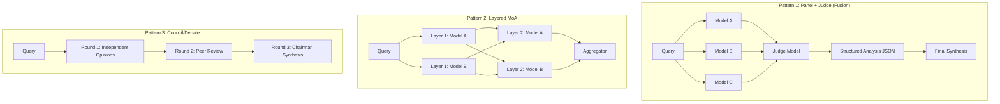
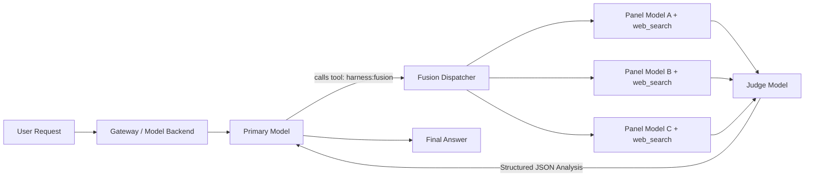
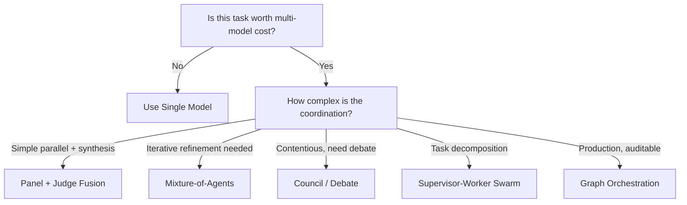

# Multi-Model Deliberation, Swarms & Council Patterns

> Comprehensive research on multi-model deliberation architectures — panel/judge fusion, council/debate, mixture-of-agents, and supervisor-worker swarms — with practical guidance on self-hosted recreation.

---

## 1. Taxonomy of Multi-Model Orchestration Patterns

Multi-model orchestration in 2026 spans a spectrum from simple parallel inference to complex iterative debate. The following taxonomy classifies the five dominant patterns by their architecture, communication model, and use case.



### Pattern 1: Panel + Judge (Fusion)

**Architecture**: Fan-out → Parallel Panel → Structured Judge → Synthesis
**Communication**: Unidirectional (panel members never see each other)
**Hallmark Product**: OpenRouter Fusion [CLAIM-145]

The Panel + Judge pattern dispatches a prompt to a panel of 2–8 models that answer in **complete isolation** (preventing anchoring bias). A designated **judge model** then receives all panel responses and produces a **structured JSON analysis** — not a merge — identifying:

- **Consensus**: Points where most or all models agree (high-confidence signals)
- **Contradictions**: Areas of direct conflict between models
- **Partial Coverage**: Information present in some responses but missing from others
- **Unique Insights**: High-value perspectives found in only one response
- **Blind Spots**: Important areas none of the panelists addressed [CLAIM-145]

The structured analysis is then fed to a **synthesis model** (which may be the caller or a separate frontier model) that writes the final answer informed by this meta-analysis.

**Key Properties**:
- Panel models operate in **strict isolation** — no cross-contamination
- Judge produces **structured JSON**, not freeform text — enabling programmatic downstream processing
- Single-level recursion: fusion calls cannot invoke fusion again (depth protection via `x-openrouter-fusion-depth` headers) [CLAIM-146]
- Latency is bounded by the **slowest panelist** + judge synthesis time

### Pattern 2: Mixture-of-Agents (MoA)

**Architecture**: Multi-layered, iterative refinement
**Communication**: Each layer consumes outputs from the prior layer
**Hallmark Paper**: Wang et al., "Mixture-of-Agents Enhances Large Language Model Capabilities" (ICLR 2025) [CLAIM-147]

MoA organizes models into **sequential layers**. In each layer, every agent receives the original query **plus** the outputs from all agents in the preceding layer as "auxiliary information." The final layer typically uses a single **aggregator model** to synthesize the refined outputs into a final answer.

The foundational insight is the **collaborativeness** property: LLMs tend to produce better outputs when they can reference and build upon prior responses, even from weaker models. The MoA paper demonstrated that an **open-source-only MoA** (using Llama, Qwen, and similar models) achieved state-of-the-art results on AlpacaEval 2.0, **outperforming GPT-4** as a standalone model [CLAIM-147].

**Key Properties**:
- **Iterative refinement**: Each layer improves on the previous (typically 2–3 layers)
- Agents within a layer see **previous layer outputs** (unlike Fusion's strict isolation)
- Computationally expensive: $N \times L$ model calls for $N$ models across $L$ layers
- Open-source reference implementation from Together AI in ~50 lines of Python [CLAIM-148]

### Pattern 3: Council / Debate

**Architecture**: Multi-round deliberation with peer review
**Communication**: Bidirectional — models critique and rank each other
**Hallmark Project**: Karpathy's `llm-council` (GitHub) [CLAIM-149]

The Council pattern runs a 3-stage workflow:

1. **Stage 1 — Independent Opinions**: The query is sent to multiple LLMs simultaneously. Models answer in isolation to prevent anchoring bias [CLAIM-149].
2. **Stage 2 — Peer Review / Voting**: Models receive each other's responses (**anonymized** to prevent lab-bias, e.g., GPT models favoring GPT outputs). They rank, critique, and score each other based on accuracy, insight, and clarity [CLAIM-149].
3. **Stage 3 — Chairman Synthesis**: A designated "Chairman" LLM reviews all initial responses and peer critiques to compile a single, refined final answer [CLAIM-149].

**Key Properties**:
- **Anonymity is critical**: Strip model identifiers to prevent self-preference bias [CLAIM-150]
- **Anti-sycophancy measures**: Use "rotating challengers" or anti-capitulation prompts to prevent models from simply agreeing with the majority [CLAIM-150]
- **Adaptive stopping**: Advanced implementations end deliberation when models converge, rather than running fixed rounds [CLAIM-150]
- Research shows ~35.9% hallucination reduction via multi-agent consensus compared to single-model setups [CLAIM-151]

### Pattern 4: Supervisor-Worker Swarm

**Architecture**: Hierarchical tree — manager delegates to specialized workers
**Communication**: Top-down delegation, bottom-up results
**Hallmark Implementations**: Hermes `Team*` tools, CrewAI `Process.hierarchical`, OpenAI Agents SDK handoffs [CLAIM-152]

A **supervisor agent** (or "manager") receives the high-level objective, decomposes it into sub-tasks, and delegates each to **specialized worker agents**. Workers may have unique tools, model tiers, and context windows. Results flow back up to the supervisor for assembly.

**Key Properties**:
- **Context isolation**: Each worker has its own conversation context (doesn't pollute parent's prompt cache) [CLAIM-076]
- **Budget sharing**: Parent shares its remaining token/cost budget with workers [CLAIM-076]
- **RPC-based tool access**: Workers call parent's tools via RPC without duplicating registrations [CLAIM-076]
- **Kanban orchestration**: Hermes implements structured multi-agent workflows via a Kanban plugin (board → dispatcher → workers) [CLAIM-076]

### Pattern 5: Graph-Based Orchestration

**Architecture**: Explicit state machine with conditional edges and cycles
**Communication**: Via shared state channels and reducer functions
**Hallmark Framework**: LangGraph `StateGraph` [CLAIM-153]

Graph-based orchestration models multi-model deliberation as a **directed graph** where:
- **Nodes** represent individual model calls (specialists, critics, synthesizers)
- **Edges** define routing logic (conditional branching based on confidence scores or vote tallies)
- **Cycles** enable iterative refinement (debate loops that re-enter nodes until consensus)
- **Reducers** merge messages from parallel branches into unified state [CLAIM-153]

**Key Properties**:
- **Explicit control flow**: Every transition is auditable and debuggable
- **Conditional routing**: A supervisor node can loop back to critics if consensus confidence is below threshold
- **Human-in-the-loop**: First-class support for governance gates as graph nodes [CLAIM-153]
- **State persistence**: Full deliberation history is persisted for auditability [CLAIM-153]

---

## 2. Comparative Analysis

| Dimension | Panel + Judge (Fusion) | MoA (Layered) | Council / Debate | Supervisor-Worker Swarm | Graph Orchestration |
| :--- | :--- | :--- | :--- | :--- | :--- |
| **Isolation** | Strict (no cross-talk) | Partial (layer-to-layer) | None (peer review) | Process-level | State-level |
| **Rounds** | 1 (parallel panel + judge) | L layers (typically 2–3) | 2–3 rounds (opinion → review → synthesis) | Varies (delegation depth) | Configurable (cycle limits) |
| **Latency** | Slowest panelist + judge | N × L sequential layers | 3 × slowest model | Deepest delegation chain | Depends on graph topology |
| **Cost** | N panel + 1 judge calls | N × L total calls | 3N calls (opinion + review + synthesis) | 1 + W worker calls | Varies by graph |
| **Best For** | Research, expert critique, factual accuracy | Complex reasoning, iterative refinement | Contentious topics, balanced perspectives | Task decomposition, parallel workstreams | Production systems needing auditability |
| **Worst For** | Simple tactical prompts | Latency-sensitive tasks | Cost-sensitive applications | Simple single-model tasks | Rapid prototyping |

---

## 3. Real-World Implementations & Open Source (June 2026)

### 3.1 OpenRouter Fusion (Hosted API)

OpenRouter Fusion is the most polished hosted implementation of the Panel + Judge pattern [CLAIM-145]. It offers three entry points — all hitting the same pipeline:

1. **Model alias**: `model: "openrouter/fusion"` — router auto-injects fusion tools
2. **Server tool**: Include `openrouter:fusion` in your tools array — model decides when to invoke
3. **Plugin config**: Fine-grained control over panel composition and judge selection

**Configuration example**:
```json
{
  "model": "openrouter/fusion",
  "plugins": [{
    "id": "fusion",
    "analysis_models": [
      "~anthropic/claude-opus-latest",
      "~openai/gpt-latest",
      "~google/gemini-pro-latest"
    ],
    "model": "~openai/gpt-latest"
  }]
}
```

**Presets** allow quick configuration without naming models:
- `general-high`: Strongest all-round panel (frontier models)
- `general-budget`: Cheaper panel with a frontier judge for cost-effective synthesis [CLAIM-145]

Panel and judge models both have `openrouter:web_search` and `openrouter:web_fetch` enabled for grounded, current information [CLAIM-145].

### 3.2 Karpathy's `llm-council` (Open Source Reference)

The most widely cited open-source council implementation, created by Andrej Karpathy as a local web application [CLAIM-149]:

- **Stage 1**: Sends user query to multiple LLMs simultaneously
- **Stage 2**: Models receive anonymized peer responses and rank/critique them
- **Stage 3**: Chairman LLM compiles final answer from all opinions and critiques

The repository is intentionally minimal ("vibe coded weekend hack") but has spawned a large ecosystem of derived projects curated at **[danielrosehill/Awesome-LLM-Council-Projects](https://github.com/danielrosehill/Awesome-LLM-Council-Projects)** [CLAIM-154]:

| Project | Focus |
| :--- | :--- |
| **Consilium** | CLI with anti-sycophancy prompts and rotating challengers [CLAIM-150] |
| **PolyCouncil** | Local-model councils (via LM Studio) with shared rubrics |
| **`judges` library** | `Jury` objects for LLM-as-judge aggregation |
| **`llm-deliberate`** | Social choice theory voting mechanisms for model convergence |
| **`llm-council-skill`** | Claude Code skill integration for planning |

### 3.3 Together AI MoA Reference (Open Source)

Together AI provides a minimal ~50-line Python reference implementation of the Mixture-of-Agents paper [CLAIM-148]. It uses the `together` Python SDK to orchestrate:
- **Proposer models**: Multiple models generate independent responses
- **Aggregator model**: A single model synthesizes all proposer outputs
- Models and layer count are configurable

### 3.4 CrewAI Hierarchical Process

CrewAI implements the Supervisor-Worker pattern via its `Process.hierarchical` configuration [CLAIM-152]:

```python
from crewai import Crew, Process

council = Crew(
    agents=[researcher, writer, auditor],
    tasks=[task1, task2],
    process=Process.hierarchical,
    manager_llm=your_llm_instance  # Manager auto-delegates
)
```

- A **Manager agent** is automatically created (or explicitly defined) to delegate sub-tasks
- Workers have role-specific tools and backstories
- `allow_delegation=True` enables agent-to-agent task passing
- Native support for A2A protocols, built-in memory, and checkpointing [CLAIM-152]

### 3.5 LangGraph StateGraph Deliberation

LangGraph implements council patterns via explicit graph topologies [CLAIM-153]:

```python
from langgraph.graph import StateGraph

graph = StateGraph(DeliberationState)
graph.add_node("panel_a", call_model_a)
graph.add_node("panel_b", call_model_b)
graph.add_node("judge", synthesize_responses)
graph.add_node("critic", evaluate_consensus)

# Parallel fan-out to panel
graph.add_edge(START, "panel_a")
graph.add_edge(START, "panel_b")

# Both feed into judge
graph.add_edge("panel_a", "judge")
graph.add_edge("panel_b", "judge")

# Judge routes to critic or end
graph.add_conditional_edges("judge", check_confidence,
    {"low": "critic", "high": END})

# Critic can loop back
graph.add_edge("critic", "panel_a")
graph.add_edge("critic", "panel_b")
```

Key primitives:
- **Conditional edges**: Route based on confidence scores or vote tallies
- **Reducers**: Merge messages from parallel branches into unified state
- **Cycles**: Re-enter panel nodes if critic deems consensus insufficient
- **Human-in-the-loop**: Insert governance gate nodes [CLAIM-153]

### 3.6 Microsoft Agent Framework (MAF)

The production successor to AutoGen and Semantic Kernel [CLAIM-155]:
- Shifts from "conversational chaos" (unbounded debate loops) to **explicit graph-based workflows**
- Provides strict type safety, durable state, enterprise telemetry, and checkpointing
- The community fork **AG2** preserves the original AutoGen conversational debate style for research use [CLAIM-155]

### 3.7 OpenAI Agents SDK

The production evolution of the experimental Swarm framework (March 2025) [CLAIM-156]:
- Built-in tracing, guardrails, session management, and observability
- Agent-to-agent **handoff** primitives for structured delegation
- Replaces Swarm's educational/experimental scope with production-grade tooling [CLAIM-156]

---

## 4. How to Self-Host & Recreate Fusion in the Harness

The following architecture describes how to implement OpenRouter Fusion-like multi-model deliberation as a **gateway-level tool** within the model-agnostic harness.

### 4.1 Architecture Overview



### 4.2 Implementation Steps

#### Step 1: Register the Fusion Tool

The gateway injects a `harness:fusion` tool definition into outbound model requests when the fusion plugin is enabled:

```typescript
const fusionToolSchema = {
  type: "function",
  function: {
    name: "harness__fusion",
    description: "Invoke a multi-model deliberation panel. Use when the query benefits from multiple expert perspectives, requires high factual accuracy, or involves contentious/ambiguous topics.",
    parameters: {
      type: "object",
      properties: {
        query: {
          type: "string",
          description: "The question or analysis request to send to the panel."
        },
        context: {
          type: "string",
          description: "Optional additional context to provide to all panel models."
        }
      },
      required: ["query"]
    }
  }
};
```

#### Step 2: Parallel Panel Dispatch

When the primary model invokes `harness__fusion`, the gateway dispatches the query to all panel models **in parallel** via the configured OpenAI-compatible backend (OpenRouter, Ollama, LiteLLM, etc.):

```typescript
async function dispatchPanel(
  query: string,
  panelModels: string[],
  config: FusionConfig
): Promise<PanelResponse[]> {
  const promises = panelModels.map(model =>
    litellm.completion({
      model,
      messages: [
        { role: "system", content: "You are an expert analyst. Answer thoroughly and cite sources." },
        { role: "user", content: query }
      ],
      tools: config.enableWebSearch
        ? [webSearchTool, webFetchTool]
        : [],
      max_tool_calls: config.maxToolCalls ?? 8
    })
  );

  const results = await Promise.allSettled(promises);

  return results.map((result, i) => ({
    model: panelModels[i],
    status: result.status,
    response: result.status === "fulfilled"
      ? result.value.choices[0].message.content
      : `[ERROR: ${result.reason}]`
  }));
}
```

> **Design Decision**: Use `Promise.allSettled()` (not `Promise.all()`) to ensure a single panel failure doesn't abort the entire deliberation. Partial panels are often still valuable [CLAIM-145].

#### Step 3: Judge Prompt Engineering

The judge receives all panel responses with **model identifiers stripped** (anonymized) and produces structured JSON analysis:

```typescript
const judgeSystemPrompt = `You are a rigorous analytical judge. You will receive multiple expert responses to the same question. Your job is NOT to merge them — it is to COMPARE and ANALYZE them.

Produce a JSON object with exactly these fields:
- "consensus": Array of points where most or all experts agree (high confidence)
- "contradictions": Array of points where experts directly disagree, with reasoning about which position is stronger
- "partial_coverage": Array of points covered by some experts but not others
- "unique_insights": Array of high-value perspectives found in only one expert response
- "blind_spots": Array of important aspects that NO expert addressed
- "confidence_score": Float 0.0-1.0 representing overall consensus strength

Do NOT reveal which response came from which model. Evaluate purely on substance.`;

const judgeUserPrompt = panelResponses.map((r, i) =>
  `## Expert ${i + 1}\n${r.response}`
).join("\n\n---\n\n");
```

#### Step 4: Recursion Protection

Prevent infinite nested fusion calls:

```typescript
function shouldInjectFusionTool(headers: Record<string, string>): boolean {
  const depth = parseInt(headers["x-harness-fusion-depth"] ?? "0");
  return depth < 1; // Only allow fusion at depth 0
}

// When dispatching panel/judge calls, increment depth:
const panelHeaders = {
  "x-harness-fusion-depth": String(currentDepth + 1)
};
```

#### Step 5: Adaptive Stopping (Optional)

For cost optimization, short-circuit when early consensus is detected:

```typescript
interface FusionConfig {
  panelModels: string[];
  judgeModel: string;
  enableWebSearch: boolean;
  maxToolCalls: number;
  confidenceThreshold: number; // e.g., 0.85
  enableAdaptiveStopping: boolean;
}

// If judge reports high confidence, skip additional rounds
if (config.enableAdaptiveStopping &&
    judgeAnalysis.confidence_score >= config.confidenceThreshold) {
  return judgeAnalysis; // Skip any potential follow-up rounds
}
```

### 4.3 Cost & Latency Analysis

| Configuration | Panel Cost | Judge Cost | Total | Latency |
| :--- | :--- | :--- | :--- | :--- |
| **Budget** (3× Flash models + 1 frontier judge) | ~$0.003 | ~$0.05 | ~$0.053/query | 5–10s |
| **Quality** (3× frontier + 1 frontier judge) | ~$0.15 | ~$0.05 | ~$0.20/query | 15–30s |
| **Maximum** (8× frontier + web search + frontier judge) | ~$0.40 | ~$0.10 | ~$0.50/query | 30–60s |

> **Critical Insight**: Budget panels with frontier judges have been shown to **outperform** standalone frontier models on the DRACO benchmark at ~25% of the cost. Even self-synthesis (pairing a model with itself) improves quality [CLAIM-157].

---

## 5. Anti-Patterns, Gotchas & Design Rules

### 5.1 Anchoring Bias
**Gotcha**: If panel models see each other's outputs during the initial response phase, they "anchor" to the first response and produce less diverse perspectives.
**Rule**: Panel models **must** deliberate in complete isolation during the initial response phase. Cross-pollination is only permitted in explicit peer-review rounds (Council pattern) or subsequent MoA layers [CLAIM-145].

### 5.2 Sycophancy
**Gotcha**: During peer review rounds, models tend to change their answers to match the majority or the most confident-sounding response without genuine reasoning.
**Mitigations**:
- Use **rotating challengers**: Assign one model the explicit role of devil's advocate in each round [CLAIM-150]
- Use **anti-capitulation prompts**: Instruct models to maintain their position unless presented with genuine evidence [CLAIM-150]
- **Adaptive stopping**: End deliberation when positions stabilize rather than running fixed rounds

### 5.3 Judge Bias
**Gotcha**: Judge models may prefer responses that match their own training style or "voice." A GPT judge may systematically favor GPT panel responses.
**Mitigations**:
- **Anonymize responses**: Strip all model identifiers, formatting signatures, and provider-specific patterns before presenting to the judge [CLAIM-150]
- **Structured rubrics**: Provide explicit scoring rubrics covering accuracy, completeness, and logical consistency to reduce reliance on subjective style preferences
- **Evaluate truth and usefulness on separate axes**: This prevents a judge from conflating "sounds authoritative" with "is correct" [CLAIM-157]

### 5.4 Cost Explosion
**Gotcha**: Enabling web search on all 8 panel models with 16 max tool calls each can multiply costs 8× or more beyond the base panel cost.
**Mitigations**:
- Cap `max_tool_calls` (default 8, max 16) per panel model [CLAIM-145]
- Use **budget presets**: Cheaper panel models with a single frontier judge
- Implement **per-query cost ceilings**: Abort the panel if accumulated costs exceed a threshold

### 5.5 Over-Engineering
**Gotcha**: Multi-model deliberation adds latency, cost, and complexity. Using fusion for simple extraction, summarization, or tactical prompts wastes resources.
**Rule**: Fusion is an **escalation lane**. Use it only when the cost of being wrong outweighs the cost of multiple completions — research, expert critique, high-stakes decisions, or contentious topics [CLAIM-145].

### 5.6 Regex Avoidance in Deliberation Parsing
Consistent with the harness-wide design constraint [CLAIM-137]: parsing judge analysis JSON must use programmatic JSON/JSON5 decoders, never regex extraction. Judge outputs may include markdown wrappers, code fences, or trailing commentary that break regex-based extraction.

---

## 6. Benchmarks & Evidence

### 6.1 DRACO Benchmark (2026)

The **DRACO** (Deep Research Accuracy, Completeness, and Objectivity) benchmark evaluates deep research AI agents using real-world, anonymized research queries across four dimensions: factual accuracy, breadth/depth of analysis, presentation quality, and source citation [CLAIM-157].

Key findings:
- **Budget fusion panels outperform individual frontier models**: Combinations like Gemini 3 Flash + Kimi K2.6 + DeepSeek V4 Pro, synthesized by a frontier judge, consistently outperform standalone GPT-5.5 or Claude Opus 4.8 at ~50% of the cost [CLAIM-157]
- **Self-synthesis improves quality**: Even pairing a single model with itself (running it twice and synthesizing) produces measurably better outputs than a single run [CLAIM-157]
- **Beyond-frontier performance**: Multi-model fusion achieves scores that no individual model can reach on its own [CLAIM-157]

### 6.2 MoA Paper Results (ICLR 2025)

The Mixture-of-Agents paper demonstrated [CLAIM-147]:
- An **open-source-only MoA** (using Llama, Qwen, and similar models) achieved **state-of-the-art on AlpacaEval 2.0**, outperforming GPT-4 as a standalone model
- The collaborativeness property: models produce better outputs when they can reference prior responses, even from weaker models
- 2–3 layers provide the optimal quality-to-cost tradeoff

### 6.3 Hallucination Reduction

Research demonstrates a **~35.9% reduction in hallucination rates** via multi-agent consensus compared to single-model setups [CLAIM-151]. The mechanism: when models independently arrive at the same factual claim, the confidence in that claim is much higher than any single model's assertion.

---

## 7. Decision Matrix: When to Use Each Pattern



| Use Case | Recommended Pattern | Reasoning |
| :--- | :--- | :--- |
| **Quick factual question** | Single model | Fusion adds unnecessary latency and cost |
| **Research report with citations** | Panel + Judge (Fusion) | Diverse perspectives improve accuracy and coverage |
| **Code review / security audit** | Council / Debate | Peer critique catches bugs that consensus might miss |
| **Complex multi-file refactor** | Supervisor-Worker Swarm | Task decomposition across specialists |
| **Legal/medical analysis** | Council with HITL gate | High stakes demand peer review AND human sign-off |
| **Iterative creative writing** | MoA (2–3 layers) | Each layer refines style and substance |
| **Production classification pipeline** | Graph Orchestration | Auditability and explicit control flow are essential |
| **Prediction market resolution** | Council / Debate | Deliberation reduces bias and single-model overconfidence |

---

## 8. Framework Selection Guide (June 2026)

| Framework | Best For | Pattern Support | License | Maturity |
| :--- | :--- | :--- | :--- | :--- |
| **LangGraph** | Production graph-based orchestration | All patterns via StateGraph | MIT | High |
| **CrewAI** | Role-based prototyping, quick setup | Supervisor-Worker, Council | Apache-2.0 | High |
| **OpenAI Agents SDK** | OpenAI-centric production | Supervisor-Worker (handoffs) | MIT | High |
| **Microsoft Agent Framework** | Enterprise, Azure-native | Explicit graph workflows | MIT | Medium |
| **AG2 (AutoGen fork)** | Research, conversational debate | Council / Debate | Apache-2.0 | Medium |
| **OpenRouter Fusion** | Zero-code hosted fusion | Panel + Judge | Hosted API | High |
| **Together AI MoA** | MoA prototyping | Mixture-of-Agents | MIT | Low (reference) |

---

## Sources Used

| Source | Type | URL | Relevance |
| :--- | :--- | :--- | :--- |
| OpenRouter Fusion documentation | Online docs | https://openrouter.ai/docs/guides/features/plugins/fusion | CRITICAL — primary inspiration |
| Wang et al., "Mixture-of-Agents Enhances LLM Capabilities" (ICLR 2025) | Paper | https://arxiv.org/abs/2406.04692 | CRITICAL — foundational MoA research |
| Karpathy's `llm-council` | GitHub repo | https://github.com/karpathy/llm-council | HIGH — reference council implementation |
| danielrosehill/Awesome-LLM-Council-Projects | GitHub repo | https://github.com/danielrosehill/Awesome-LLM-Council-Projects | HIGH — ecosystem survey |
| DRACO benchmark (2026) | Benchmark | https://openrouter.ai/rankings | HIGH — fusion performance evidence |
| CrewAI documentation | Online docs | https://docs.crewai.com/concepts/processes | HIGH — hierarchical process pattern |
| LangGraph documentation | Online docs | https://langchain-ai.github.io/langgraph/ | HIGH — graph-based orchestration |
| OpenAI Agents SDK | GitHub repo | https://github.com/openai/openai-agents-python | MEDIUM — Swarm successor |
| Microsoft Agent Framework | GitHub repo | https://github.com/microsoft/autogen | MEDIUM — AutoGen successor |
| Together AI MoA reference | GitHub repo | https://github.com/togethercomputer/MoA | MEDIUM — MoA reference implementation |
| Hermes Agent `Team*` tools | Local codebase | https://github.com/NousResearch/hermes-agent | HIGH — swarm team implementation |

