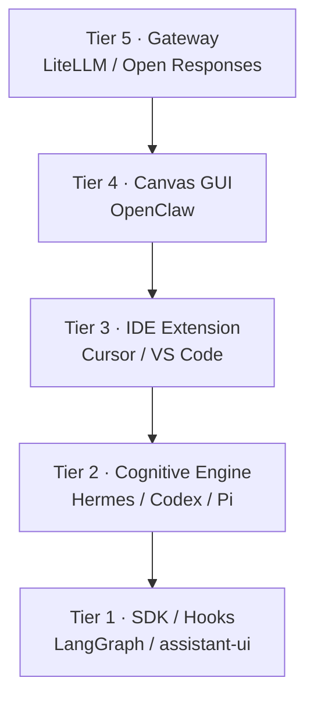

<p align="center">
  
</p>

<h1 align="center">Make No Mistakes</h1>

<p align="center">
  <strong>Open research ebook for building a model-agnostic agent harness</strong><br/>
  <sub>June 2026 · synthesized from 12 reference codebases</sub>
</p>

<p align="center">
  <a href="https://mrgizmo212.github.io/make-no-mistakes/"></a>
  <a href="19_final_reports/harness_architecture_specification_report.md"></a>
  <a href="SUMMARY.md"></a>
</p>

<p align="center">
  
  
  
  
</p>

---

## What is this?

A **GitHub-native ebook**: markdown chapters, citation traceability, and a full technical architecture spec for a modern agent harness — loops, memory, subagents, tools, MCPs, skills, voice, and a 5-tier stack.

> **No submodules.** Reference repos are linked upstream. This repo is the book.

---

## Composite architecture — not a codebase merge

**You are not forking Hermes, Codex, Pi, LangGraph, OpenClaw, LibreChat, and the rest into one mega-repo.**

This research recommends building **one new harness** using a **composite approach**: each reference project is a **pattern donor** for a specific layer, connected by standard protocols (OpenAI-compatible APIs, MCP, SSE, `SKILL.md`, etc.).

| What the spec means | What it does **not** mean |
|:---|:---|
| Tier 2 behaves *like* Hermes/Codex/Pi (ReAct loop, tools, safety) | Copy all three engines into one tree |
| Tier 5 *routes through* LiteLLM or Open Responses | Ship their full codebases inside yours |
| Tier 4 *looks like* OpenClaw / assistant-ui patterns | Replace your backend by forking OpenClaw wholesale |
| Study LibreChat, LangGraph, LangChain for routing & state | Run every framework as a hard dependency stack |

**Design principle:** *narrow waist, rich edges* — a thin shared core (model API + agent runtime), with capabilities plugged in at the edges.

→ Full rationale: [Architecture Recommendations — Composite Approach](18_architecture_recommendations/README.md#recommended-architecture-the-composite-approach)

---

## Start here

| | |
|:---|:---|
| **Read the site** | [**mrgizmo212.github.io/make-no-mistakes**](https://mrgizmo212.github.io/make-no-mistakes/) |
| **The spec** | [Technical Architecture Specification](19_final_reports/harness_architecture_specification_report.md) |
| **Recommendations** | [Architecture Recommendations](18_architecture_recommendations/README.md) |
| **Table of contents** | [SUMMARY.md](SUMMARY.md) |
| **Provenance** | [Sources](00_index/source_registry.md) · [Citations](00_index/citation_map.md) |

---

## 5-tier harness stack

A **layer diagram**, not a shopping list to merge. Names like “Hermes” or “LiteLLM” mark **which project inspired that tier** — not repos you vendor together.



---

## What's inside

| Part | Topics |
|:---|:---|
| **I · Landscape** | SDKs, frameworks, coding agents |
| **II · Core systems** | Loops, memory, subagents, tools, MCPs, skills, voice |
| **III · Architecture** | Model-agnostic harness, backend & frontend stacks |
| **IV · Studies** | Hermes, Codex, Pi, LangGraph, LangChain, OpenClaw, LiteLLM, … |
| **V · Synthesis** | Comparisons, recommendations, final spec |

---

## Clone & read offline

```bash
git clone https://github.com/mrgizmo212/make-no-mistakes.git
cd make-no-mistakes
# open SUMMARY.md or start at 19_final_reports/harness_architecture_specification_report.md
```

---

<p align="center">
  <sub>Research & synthesis © 2026 · Upstream projects retain their own licenses</sub>
</p>
