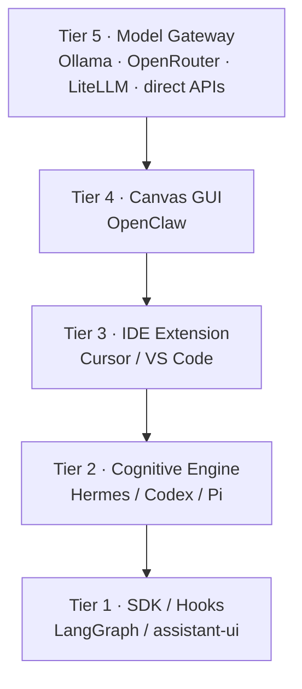

<p align="center">
  
</p>

<h1 align="center">Make No Mistakes</h1>

<p align="center">
  <strong>An open research ebook for building a model-agnostic agent harness.</strong><br/>
  <sub>June 2026 · 217 verified claims · 30 sources · 12 codebases studied</sub>
</p>

<p align="center">
  <a href="https://mrgizmo212.github.io/make-no-mistakes/"></a>
  <a href="19_final_reports/harness_architecture_specification_report.md"></a>
  <a href="SUMMARY.md"></a>
</p>

<p align="center">
  
  
  
  
</p>

---

## What is this?

A **GitHub-native research ebook** focused on building a clean, model-agnostic **agent harness** — loops, memory, subagents, tools, MCPs, skills, voice, and a practical 5-tier architecture.

> No messy submodules. No forking everything into one repo.  
> Just the best patterns, synthesized.

---

## Composite architecture — not a codebase merge

**You are not supposed to fork Hermes, Codex, Pi, LangGraph, OpenClaw and friends into one giant monorepo.**

This book treats them as **pattern donors** for different layers, connected through standard interfaces (OpenAI-compatible APIs, MCP, SSE, `SKILL.md`, etc.).

| What the spec *means* | What it does **not** mean |
|:---|:---|
| Tier 2 behaves *like* Hermes/Codex/Pi | Copy their entire codebases |
| Tier 5 talks to **your** model backend (Ollama, OpenRouter, etc.) | Require LiteLLM or vendor a proxy repo |
| Tier 4 draws from OpenClaw patterns | Fork OpenClaw as your base |

**Core principle:** *Narrow waist, rich edges.*

→ [Full Architecture Recommendations](18_architecture_recommendations/README.md)

---

## Start here

| | |
|:---|:---|
| **📖 Live Site** | [mrgizmo212.github.io/make-no-mistakes](https://mrgizmo212.github.io/make-no-mistakes/) |
| **⚡ The Spec** | [Harness Architecture Specification](19_final_reports/harness_architecture_specification_report.md) |
| **Recommendations** | [Architecture Recommendations](18_architecture_recommendations/README.md) |
| **Full TOC** | [SUMMARY.md](SUMMARY.md) |
| **Provenance** | [Sources](00_index/source_registry.md) · [Citations](00_index/citation_map.md) |

---

## 5-Tier Harness Stack



---

## What's inside

| Part | Topics |
|:---|:---|
| **I · Landscape** | SDKs, frameworks, coding agents |
| **II · Core systems** | Loops, memory, subagents, tools, MCPs, skills, voice |
| **III · Architecture** | Model-agnostic harness, backend & frontend stacks |
| **IV · Studies** | Hermes, Codex, Pi, LangGraph, LangChain, OpenClaw, LiteLLM, … |
| **V · Synthesis** | Comparisons, recommendations, final spec |

---

## Clone & read offline

```bash
git clone https://github.com/mrgizmo212/make-no-mistakes.git
cd make-no-mistakes
# open SUMMARY.md or start at 19_final_reports/harness_architecture_specification_report.md
```

---

<p align="center">
  <sub>Research & synthesis © 2026 · Upstream projects retain their own licenses</sub>
</p>
