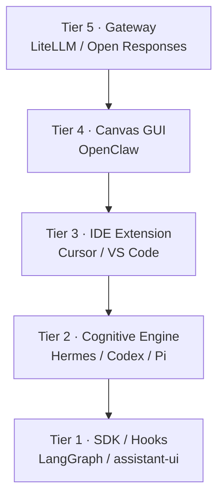

# Make No Mistakes

**An open research ebook for building a model-agnostic agent harness.**

June 2026 · 217 verified claims · 30 sources · 12 codebases studied

---

## Start reading

| | |
|:---|:---|
| **The spec** | [Technical Architecture Specification](19_final_reports/harness_architecture_specification_report.md) |
| **Full TOC** | [Table of Contents](SUMMARY.md) |
| **Recommendations** | [Architecture Recommendations](18_architecture_recommendations/README.md) |
| **Citations** | [Source Registry](00_index/source_registry.md) · [Citation Map](00_index/citation_map.md) |

---

## 5-tier harness stack

---

## What you get

- **Landscape survey** — SDKs, frameworks, coding agents
- **Core systems** — loops, memory, subagents, tools, MCPs, skills
- **Architecture** — model-agnostic harness, backend & frontend stacks
- **Codebase studies** — Hermes, Codex, Pi, LangGraph, LangChain, OpenClaw, LiteLLM, Open Responses, assistant-ui, LibreChat
- **Synthesis** — comparisons, recommendations, final specification

---

## Reference codebases

This ebook cites upstream repos — it does **not** vendor them as submodules.

| Project | Role |
|:---|:---|
| [Hermes Agent](https://github.com/NousResearch/hermes-agent) | Autonomous loop, learning |
| [Codex](https://github.com/openai/codex) | Rust coding CLI, AGENTS.md |
| [Pi](https://github.com/badlogic/pi-mono) | Minimal terminal agent |
| [LangGraph](https://github.com/langchain-ai/langgraph) | Graph orchestration |
| [LangChain](https://github.com/langchain-ai/langchain) | Model abstraction |
| [OpenClaw](https://github.com/openclaw/openclaw) | Multi-platform assistant |
| [LiteLLM](https://github.com/BerriAI/litellm) | 100+ model proxy |
| [Open Responses](https://github.com/open-responses/open-responses) | Responses API server |
| [assistant-ui](https://github.com/assistant-ui/assistant-ui) | React chat components |
| [LibreChat](https://github.com/danny-avila/LibreChat) | Personal assistant UI |
