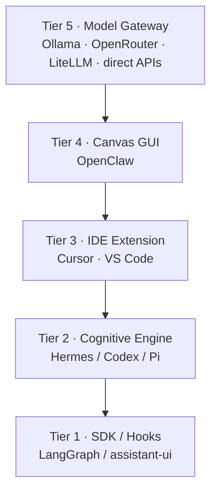

  

# Make No Mistakes

**Notes toward a model-agnostic agent harness.**

*Started June 2026 · still being edited*

---

## What this is

Working notes on how to build a clean, model-agnostic **agent harness** — loops, memory, subagents, tools, MCPs, skills, voice — organized around a 5-tier architecture.

It pulls patterns from a dozen existing projects (Hermes, Codex, Pi, LangGraph, OpenClaw, LiteLLM, and others) and tries to say which layer each one is actually good at.

---

## It's a composite, not a merge

You are not supposed to fork Hermes, Codex, Pi, LangGraph, and OpenClaw into one giant monorepo. That's the mistake this whole thing is named after.

Instead, treat each project as a **pattern donor** for a specific layer, and wire them together through interfaces that already exist: OpenAI-compatible APIs, MCP, SSE, `SKILL.md`.

| The spec means | It does **not** mean |
|:---|:---|
| Tier 2 behaves *like* Hermes/Codex/Pi | Copy their codebases |
| Tier 5 talks to your model backend (Ollama, OpenRouter, …) | Vendor a proxy repo or require LiteLLM |
| Tier 4 borrows OpenClaw patterns | Fork OpenClaw as your base |

Narrow interfaces, opinionated layers.

→ [Full architecture recommendations](18_architecture_recommendations/README.md)

---

## Start here

| | |
|:---|:---|
| **The spec** | [Harness Architecture Specification](19_final_reports/harness_architecture_specification_report.md) |
| **Full TOC** | [Table of Contents](SUMMARY.md) |
| **Recommendations** | [Architecture Recommendations](18_architecture_recommendations/README.md) |
| **Citations** | [Source Registry](00_index/source_registry.md) · [Citation Map](00_index/citation_map.md) |

---

## The 5-tier stack

Tier 3 leans on Cursor's agent model — see the [Cursor Agent docs](https://cursor.com/docs/agent/overview) and [SRC-021](00_index/source_registry.md).

---

## What's inside

| Part | Topics |
|:---|:---|
| I · Landscape | SDKs, frameworks, coding agents |
| II · Core systems | Loops, memory, subagents, tools, MCPs, skills, voice |
| III · Architecture | Model-agnostic harness, backend & frontend stacks |
| IV · Studies | Hermes, Codex, Pi, LangGraph, LangChain, OpenClaw, LiteLLM, … |
| V · Synthesis | Comparisons, recommendations, final spec |

---

## Reference codebases

Upstream repos — linked, not vendored. Learn from each; don't merge them.

| Project | Good for |
|:---|:---|
| [Hermes Agent](https://github.com/NousResearch/hermes-agent) | Autonomous loop, learning |
| [Codex](https://github.com/openai/codex) | Rust coding CLI, AGENTS.md |
| [Pi](https://github.com/badlogic/pi-mono) | Minimal terminal agent |
| [LangGraph](https://github.com/langchain-ai/langgraph) | Graph orchestration |
| [LangChain](https://github.com/langchain-ai/langchain) | Model abstraction |
| [OpenClaw](https://github.com/openclaw/openclaw) | Multi-platform assistant |
| [OpenRouter SDK](https://github.com/OpenRouterTeam/typescript-sdk) | Hosted multi-model routing |
| [LiteLLM](https://github.com/BerriAI/litellm) | Self-hosted proxy (optional) |
| [Ollama](https://ollama.com) | Local models via OpenAI-compat `/v1` |
| [Open Responses](https://github.com/open-responses/open-responses) | Responses API server |
| [assistant-ui](https://github.com/assistant-ui/assistant-ui) | React chat components |
| [LibreChat](https://github.com/danny-avila/LibreChat) | Personal assistant UI |

---

## About the guy who used AI to put all this together

Adam Heimann is the co-founder and CEO of [True Trading Group](https://truetradinggroup.com/), where he also leads AI strategy and product. He started out on the promotional side of penny stocks — he literally wrote [*The Penny Stock Gospel*](https://www.amazon.com/Penny-Stock-Gospel-Adam-Heimann-ebook/dp/B01J4CTWJE/), though not proud of it. Now he builds the tools he wishes those traders had had: multi-agent research workflows and practical AI that help traders and investors analyze markets faster, document plans, and manage risk.

Check out the current [90-day TTG trial for $90](https://truetradinggroup.com/9090/).

He's blunt, allergic to hype, and doesn't think the customer is always right — he'll tell you when you're the problem, because he'd rather you actually get better than feel good and stay broke. It's a posture his members reward: under Adam's direction TTG launched M.A.R.I., an Agent-as-a-Model ecosystem — AI agents exposed as a single model — that powers the TTG AI trading platform, recognized at the 2024 Benzinga Fintech Awards. TTG has since scaled a global community of more than 10,000 members across 115 countries.

A bootstrapped founder since 2006, Adam has taken multiple companies from idea to product with no outside funding, generating more than $100 million in cumulative revenue. He was also an original co-founder of LibreChat LLC, acquired by ClickHouse in November 2025. His work focuses on making institutional-grade capabilities accessible to individuals while emphasizing process, compliance awareness, and human-in-the-loop decision making.

[LinkedIn](https://www.linkedin.com/in/adam-heimann-68789610/) · [X](https://x.com/adamheimann)
