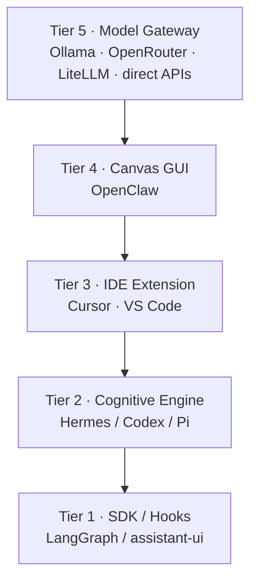

  

# Make No Mistakes

**An open research ebook for building a model-agnostic agent harness.**

June 2026 · 217 verified claims · 30 sources · 12 codebases studied

---

## Composite architecture — not a codebase merge

**You are not forking every reference repo into one project.**

This ebook describes **one new harness** built from **best patterns per layer** — connected via OpenAI-compatible APIs, MCP, SSE, and standard file conventions (`AGENTS.md`, `SKILL.md`). Reference codebases are **studied and cited**, not combined as submodules or monorepo dependencies.

| Layer | Learn from | Build yourself |
|:---|:---|:---|
| Agent loop & tools | Hermes, Codex, Pi | Your Python/TS runtime |
| State & handoffs | LangGraph patterns | Your orchestration layer |
| Chat UI | assistant-ui | Your React + Vite app |
| Gateway & channels | OpenClaw patterns | Your Node gateway |
| Model routing | OpenAI-compat APIs | Point at **Ollama** (local), **OpenRouter** (hosted multi-model), **LiteLLM** (self-hosted proxy), or direct provider APIs — pick one, not all |

→ [Architecture Recommendations](18_architecture_recommendations/README.md)

---

## Start reading

| | |
|:---|:---|
| **The spec** | [Technical Architecture Specification](19_final_reports/harness_architecture_specification_report.md) |
| **Full TOC** | [Table of Contents](SUMMARY.md) |
| **Recommendations** | [Architecture Recommendations](18_architecture_recommendations/README.md) |
| **Citations** | [Source Registry](00_index/source_registry.md) · [Citation Map](00_index/citation_map.md) |

---

## 5-tier harness stack

Each tier names **reference projects for inspiration**. The goal is a clean separation of concerns in *your* harness — not gluing those repos together.

Tier 3 case study: [Cursor Agent docs](https://cursor.com/docs/agent/overview)

---

## What you get

- **Landscape survey** — SDKs, frameworks, coding agents
- **Core systems** — loops, memory, subagents, tools, MCPs, skills
- **Architecture** — model-agnostic harness, backend & frontend stacks
- **Codebase studies** — Hermes, Codex, Pi, LangGraph, LangChain, OpenClaw, LiteLLM, Open Responses, assistant-ui, LibreChat
- **Synthesis** — comparisons, recommendations, final specification

---

## Reference codebases

These repos are **upstream references for research** — linked, not vendored. The “Role” column is what to **learn from** each project when designing your own harness.

| Project | Inspiration for (not “merge into”) |
|:---|:---|
| [Hermes Agent](https://github.com/NousResearch/hermes-agent) | Autonomous loop, learning |
| [Codex](https://github.com/openai/codex) | Rust coding CLI, AGENTS.md |
| [Pi](https://github.com/badlogic/pi-mono) | Minimal terminal agent |
| [LangGraph](https://github.com/langchain-ai/langgraph) | Graph orchestration |
| [LangChain](https://github.com/langchain-ai/langchain) | Model abstraction |
| [OpenClaw](https://github.com/openclaw/openclaw) | Multi-platform assistant |
| [OpenRouter SDK](https://github.com/OpenRouterTeam/typescript-sdk) | Hosted multi-model routing (one API key) |
| [LiteLLM](https://github.com/BerriAI/litellm) | Self-hosted 100+ model proxy (optional) |
| [Ollama](https://ollama.com) | Local models via OpenAI-compat `/v1` |
| [Open Responses](https://github.com/open-responses/open-responses) | Responses API server |
| [assistant-ui](https://github.com/assistant-ui/assistant-ui) | React chat components |
| [LibreChat](https://github.com/danny-avila/LibreChat) | Personal assistant UI |
